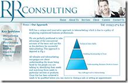

Over the past few weeks I’ve been working on a web site for my cousin. This was a ground up redesign of his company web to replace the old SEO unfriendly Flash site.

Normally as the developer I only get someone else's completed design; I just do the implementation but I wanted to see if any of my recent photography and image editing skills were transferable.

The site was first designed in Illustrator/Photoshop with a fair number of round trips to agree the final design. Implementation was done in Expression Web using HTML, CSS and some JQuery for interactivity. There are no anywhere on the site; it is a pure CSS layout. I also used Expression Web "Dynamic Web Templates" for the master page layout as the server where it is now hosted does not support .NET.

Some things I've learned from doing this:

- [jQuery](http://jquery.com/) makes life easy and [Glimmer](http://www.visitmix.com/Lab/Glimmer) makes it even easier
- IE8 standards support is fantastic but way to many still use IE6/7 to use it
- You need to have an idea of what is possible in HTML before letting loose in Photoshop
- [background-image](http://www.w3.org/TR/CSS2/colors.html#background-properties) is your friend

As it is all pretty static at the moment there are plans to move to a site that supports .NET so I can add some more features, in particular a blog and news feed. I would like to try this in ASP.MVC to get some experience there.

So go to [RJR Consulting](http://www.rjrconsulting.co.uk/ "RJR Consulting") and have a look around (especially if you need telemarketing, telesales or similar services).
