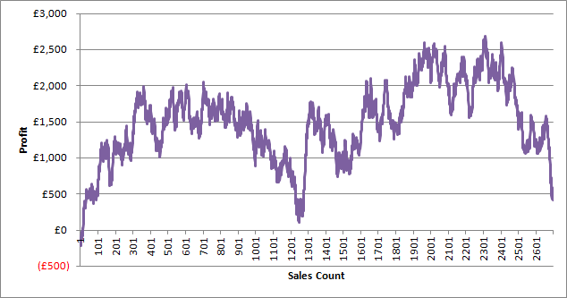
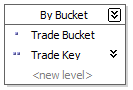

Asking for a running sum in a report is a common thing but this week I was asked to create a running sum for a particular customer against number of facts. What I mean here is to create a graph of count vs amount (sort of like a Pareto except in transaction order). So something that looks like graph above.

This is a well rehearsed subject in MDX. You can either use recursion:

With Member \[Measures\].\[Running Sum\]
As
    \[Internet Sales Order Details\].\[Sales Order Number\].PrevMember
    + 
    \[Measures\].\[Internet Gross Profit\]
Member \[Measures\].\[Running Count\]
As
    \[Internet Sales Order Details\].\[Sales Order Number\].PrevMember
    + 
    1

Select {
    \[Measures\].\[Running Count\],
    \[Measures\].\[Internet Gross Profit\],
    \[Measures\].\[Running Sum\]
} On 0, Non Empty {
    \[Internet Sales Order Details\].\[Sales Order Number\].Children
} On 1
From \[Adventure Works\]
Where (
    \[Customer\].\[Customer\].\[Brian Watson\]
)

Or, iteration (thanks to [Chris Webb](http://cwebbbi.spaces.live.com/) for some help on relative performance) which should perform better, especially on AS2008.

With Member \[Measures\].\[Running Sum\]
As 
    Sum(
        {Null : \[Internet Sales Order Details\].\[Sales Order Number\].CurrentMember},
        \[Measures\].\[Internet Gross Profit\]
    )
Member \[Measures\].\[Running Count\]
As
    Count(
        {Null : \[Internet Sales Order Details\].\[Sales Order Number\].CurrentMember}
    )
Select {
 \[Measures\].\[Running Count\],
 \[Measures\].\[Internet Gross Profit\],
 \[Measures\].\[Running Sum\]
} On 0, Non Empty {
 \[Internet Sales Order Details\].\[Sales Order Number\].Children
} On 1
From \[Adventure Works\]
Where (
 \[Customer\].\[Customer\].\[Brian Watson\]
)

\[However, on my x64 laptop the second version takes longer to execute YMMV.\]

This is OK for AdventureWorks but my real degenerate dimension has many millions of members and this just doesn’t scale. I contemplated using Reporting Services [RunningValue()](http://msdn.microsoft.com/en-us/library/ms159136.aspx "RunningValue Function (Reporting Services)") function but as far as I can tell you can’t use it to generate a category axis.

I needed a way of generating the running count for the x-axis in a way that uses Analysis Services’ excellent aggregation ability.

The solution I ended up with is to create an artificial hierarchy and bucket transactions. That way I can create an attribute relation for aggregation and, importantly, control the number of cells in the iteration.

The next problem was how to assign values to this bucket – some customers had only a few transactions yet others had millions. They all needed to be spread over a fixed set of buckets.

The answer lies in a SQL Server [RANK()](http://msdn.microsoft.com/en-us/library/ms176102.aspx "RANK (Transact-SQL)") function:

update dw.Sales
set TradeBucket = x.TradeBucket
from (
    select TradeKey,
    rank() over(partition by CustomerKey order by t.TradeKey asc) / 
    case 
        when (select COUNT(\*) from dw.Sales where CustomerKey = t.CustomerKey) < 1000 then 1
        when (select COUNT(\*) from dw.Sales where CustomerKey = t.CustomerKey) < 10000 then 10
        when (select COUNT(\*) from dw.Sales where CustomerKey = t.CustomerKey) < 100000 then 100
        when (select COUNT(\*) from dw.Sales where CustomerKey = t.CustomerKey) < 1000000 then 1000
        else 10000
    end as TradeBucket
    from dw.Sales
) x
where dw.Sales.TradeKey = x.TradeKey

Effectively, we are generating an incrementing number on a per customer basis and then dividing that number to compress the range. This is surprisingly fast to execute.

Once everything is processed, my new MDX looks like:

With Member \[Measures\].\[Running Sum\]
As     
    Sum(
        {Null : \[Internet Sales Order Details\].\[Trade Bucket\].CurrentMember},
        \[Measures\].\[Internet Gross Profit\]    
    )
Member \[Measures\].\[Running Count\] As
 Sum(
 {Null : \[Internet Sales Order Details\].\[Trade Bucket\].CurrentMember},
 \[Measures\].\[Sales Count\]
 )
Select {
 \[Measures\].\[Running Count\],
 \[Measures\].\[Internet Gross Profit\],
 \[Measures\].\[Running Sum\]
} On 0, Non Empty {
 \[Internet Sales Order Details\].\[Trade Bucket\].Children
} On 1
From \[Adventure Works\]
Where (
 \[Customer\].\[Customer\].\[Brian Watson\]
)

It works on aggregated data; there are still around 1000 points which is just fine on the graph and it executes in around 3 seconds. So all good?

Well, for now yes but I can see a problem looming – every time I do an import I update every fact row and fully reprocess the cube. That isn’t going to scale long-term. I will probably have to implement some sort of bucket partition strategy.
