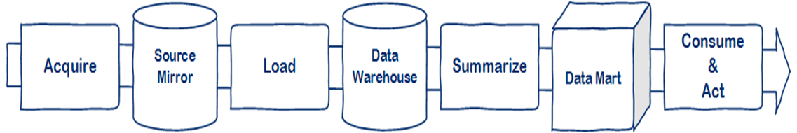

Context is everything with architecture. I’ve often had conversations which started with the phrase “how come you didn’t…” – once the context is explained the decision is usually obvious.

The context for this architecture is purely my own since there are no real customers. I  want to satisfy the concerns and requirements as simply as possible but leave room to swap out parts of the architecture to investigate new approaches and technologies.

The diagram below is a pretty standard set of data warehouse components. If you are a traditional Microsoft guy then, from left to right, the components would be [Integration Services](http://en.wikipedia.org/wiki/SQL_Server_Integration_Services "SQL Server Integration Services"), [SQL Server](http://www.microsoft.com/sqlserver "Microsoft SQL Server"), Integration Services again, SQL Server, [Analysis Services](http://technet.microsoft.com/en-us/sqlserver/cc510300.aspx "Microsoft Analysis Services") and Excel or Reporting Services respectively. Alternatively you might be using [Hadoop](http://hadoop.apache.org/ "Hadoop") as the source mirror and [Tableau](http://www.tableausoftware.com/) for the data mart and consume components or some other combination.

I always try to set firewalls within an architecture so that any problems can be isolated and replaced without too much disruption. In this instance I’m going to use those firewalls so that I can try out new ideas and technologies.

The main synchronisation points are the three data stores – Source Mirror, Data Warehouse and Data Mart. (In this instance I am using the term data mart to mean a prepared, subject area specific store optimised for analytical/aggregate queries.)

The responsibilities for each stage are as follows:

- Acquire > Source Mirror: receive data from source, ensure minimal load on source via high watermarks or another strategy, archive data for historical accuracy.  A key point here is that the source mirror has the same metadata as the source itself. No joins or transforms on the way. Sometimes simple data conversions are useful but less is more.
- Load > Data Warehouse: apply business logic and transform the source data into dimensional model, update data warehouse.
- Summarise > Data Mart: aggregate generation or cube processing.
- Consume & Act: covers any output tool such as Reporting Services, Excel, Tableau Dashboard, R, F# etc.

I consider the SQL/relational store to be “the data warehouse” and not Analysis Services which is better suited to a data mart role.

It's quite hard to be succinct when talking about architecture and this post is quite lengthy so I’ll split it and talk about risk driven architecture in the next post.
