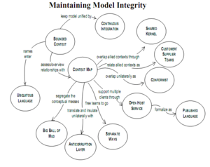

My commute is around two and a half hours each way so I read a lot on the train. One of the subjects I’ve recently become interested in [Domain Driven Design](http://dddcommunity.org/learning-ddd/what_is_ddd/) or DDD. I’ve found it isn’t really a new topic for me but more like someone has documented many of the techniques I’ve always used.

DDD discusses data warehouses primarily as an output or reporting function within a larger application. The book [Implementing Domain-Driven Design](http://www.amazon.co.uk/gp/product/0321834577/ref=as_li_ss_tl?ie=UTF8&camp=1634&creative=19450&creativeASIN=0321834577&linkCode=as2&tag=jamessnape-21) by Vaughn Vernon mentions reporting repeatedly as a by-product of DDD (particularly when used with [Event Sourcing](http://www.martinfowler.com/eaaDev/EventSourcing.html)) but not directly as a possible use case.

I would agree that not all concepts can be reused in data warehouse solutions since the only interface available is often one that transfers a set of mutations (property value changes) without the accompanying reasons (it is a key idea in DDD that you need to design your model not by changes in attributes but by operations performed on entities). For example an order count has decreased and the reason is missing – was the order returned, cancelled, an error etc. So where can it be applied? Are any of the concepts useful when designing data warehouses?

# Ubiquitous Language

Lets start with one of the core concepts – [Ubiquitous Language](http://martinfowler.com/bliki/UbiquitousLanguage.html) is a rigorous shared language used between developers and users. It is used to make sure that conversations are accurate and productive. It should evolve as the team’s understanding of a domain changes. The ubiquitous language is what forms the domain model at the heart of a software solution.

I find this description very similar to an equivalent concept in data warehousing – the [Dimensional Model](http://en.wikipedia.org/wiki/Dimensional_modeling). This model, and its associated [dimension bus matrix](http://en.wikipedia.org/wiki/Enterprise_bus_matrix), is based on real business processes and terminology. The dimensional model is the public face of the data warehouse. It needs to be precise, reflect the terms used by business users and form a common vocabulary between users and the development team. For example when browsing an Analysis Services cube in Excel, the dimensions and facts defined in the dimensional model are directly visible to end users – if they don’t automatically understand what is on-screen then the model doesn’t describe the business.

# Entities and Value Objects

There are two types of object in domain driven design – entities and [value objects](http://en.wikipedia.org/wiki/Value_object). Value objects are immutable and identified via their attributes. For example $100 USD in one object is the interchangeable with $100 USD in another. Entities on the other had cannot be identified purely by their attributes – there must be some sort of unique identifier (in data warehouse terms this is a business key) to differentiate similar entities. For example, one John Smith may not be the same as another and need a Customer-Id to differentiate the two.

With respect to dimensional models, value objects should not be implemented as top-level dimensions but instead be added at sets of attributes to the entities which own them. For example ‘Product Colour’ is a value type (colour) and should belong in the ‘Product’ dimension. This seems obvious when written this way but happens a lot.

# Entities and Aggregate Roots

DDD groups sets of closely related entities under the control of a single ‘[Aggregate root](http://devlicio.us/blogs/casey/archive/2009/02/16/ddd-aggregates-and-aggregate-roots.aspx)’. Some entities make no sense unless the parent entity is also within context; order lines and parent orders are the typical example.

So value objects shouldn’t be dimensions and I don’t think ordinary entities should be either. True dimensions are the aggregate roots and the one thing that seals it for me is that an aggregate root (according to DDD) defines a transactional boundary – you should not update multiple aggregate roots within a single transaction; instead [sagas](http://kellabyte.com/2012/05/30/clarifying-the-saga-pattern/) keep your data warehouse in sync (eventually).

# Finally

Domain driven design and business intelligence share a number of common concepts yet the two philosophies are rarely seen as related. I think there is a lot to be gained by applying software concepts from different viewpoints which may not ordinarily be considered.
