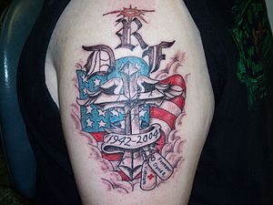

So in the comments on a recent post on [Risk Driven Architecture](http://snape.me/2013/04/27/risk-driven-architecture/#comments), [Jamie Thomson](http://sqlblog.com/blogs/jamie_thomson/) asked whether the problems associated with change can be mitigated by using views. I firmly believe that views can help but unfortunately not enough to save you from clients that connect directly with Analysis Services cubes.

So it got me thinking about a similar mitigation for cubes. Unfortunately nothing came to mind apart from an analogy:

> Dimensional models are like tattoos – you have to live with them for a long time

Why you might ask? Well you can add to them, maybe fill in some extra colour but basically once you’ve committed to you are stuck with them because every spread sheet and report using your model will need fixing if you try to remove something. Like tattoos, you can remove them but its going to be painful and cost a lot of money.

I don’t have any tattoos (not because I don’t like them, I just can’t decide on one that I’d have to live with for so long). However I’ve heard plenty of guidance about taking your time before committing – one of the best techniques is to simply draw your new tattoo with a [Sharpie](http://www.sharpie.com/Pages/GlobalLanding.aspx) and try it on for size for a while.

How does this help with dimensional models? Well the same techniques apply. Try a new model on for size, especially if you can arrange it for the new model to fade like the Sharpie as time passes which automatically limits client usage. Maybe process the cube manually for a while – your users will soon tell you if the data is useful. This fits with an agile approach too - only put measures and attributes in the cube if you need them and don’t add stuff in [the hope that it will be used productively.](http://en.wikipedia.org/wiki/You_Ain't_Gonna_Need_It)
